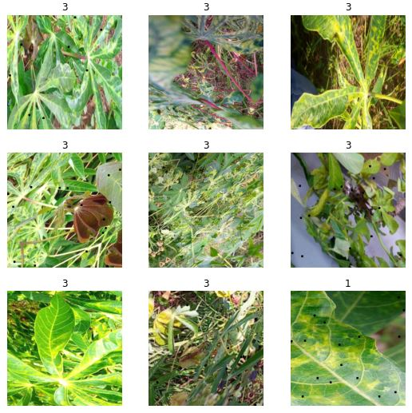
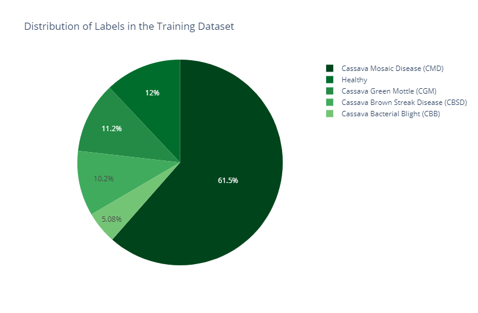
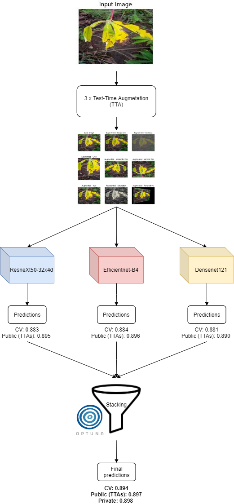
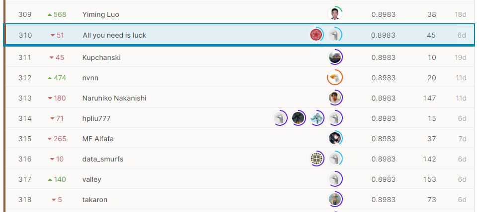

# 🌿Cassava Leaf Disease Classification 🌿
### Identify the type of disease present on a Cassava Leaf image

[Contest website](https://www.kaggle.com/c/cassava-leaf-disease-classification/overview/description) 

"As the second-largest provider of carbohydrates in Africa, cassava is a key food security crop grown by smallholder farmers because it can withstand harsh conditions. At least 80% of household farms in Sub-Saharan Africa grow this starchy root, but viral diseases are major sources of poor yields. With the help of data science, it may be possible to identify common diseases so they can be treated.

Existing methods of disease detection require farmers to solicit the help of government-funded agricultural experts to visually inspect and diagnose the plants. This suffers from being labor-intensive, low-supply and costly. As an added challenge, effective solutions for farmers must perform well under significant constraints, since African farmers may only have access to mobile-quality cameras with low-bandwidth.  

In this competition, we introduce a dataset of 21,367 labeled images collected during a regular survey in Uganda. Most images were crowdsourced from farmers taking photos of their gardens, and annotated by experts at the National Crops Resources Research Institute (NaCRRI) in collaboration with the AI lab at Makerere University, Kampala. This is in a format that most realistically represents what farmers would need to diagnose in real life.

Your task is to classify each cassava image into four disease categories or a fifth category indicating a healthy leaf. With your help, farmers may be able to quickly identify diseased plants, potentially saving their crops before they inflict irreparable damage." 

_**Quoted from contest decription.**_

## Dataset

**Train set**: ~26,000 images (21367 images of the 2020 contest was merged with 500 images from the 2019 contest).  
**Test set**: ~15,000 images.  
**Public test**: 31% of the test set.  
**Private test**: 69% of the test set.
 
**Classes mapping**

|  Class | Numeric label|
|---|---|
| Cassava Bacterial Blight (CBB)  | 0 |
| Cassava Brown Streak Disease (CBSD)  |  1 | 
|  Cassava Green Mottle (CGM)  | 2  |
|Cassava Mosaic Disease (CMD) |3 |
| Healthy|4|

  
Credit: https://www.kaggle.com/foolofatook/starter-eda-cassava-leaf-disease

## To-do list

- [x] Code baseline and trainer on GPU + TPU  
- [x] Transforms: [albumentations](https://github.com/albumentations-team/albumentations)
- [x] Implement models: EfficientNet, ViT, Resnext 
- [x] Implement losses: Focal loss, CrossEntropy loss, Bi-Tempered Loss  
- [x] Implement optimizers: SAM  
- [x] Implement schedulers: StepLR, WarmupCosineSchedule  
- [x] Implement metrics: accuracy
- [x] Write inference notebook  
- [x] Implement Stratified K-folding  
- [x] Merge 2019 dataset and 2020 dataset   
- [x] Implement gradient_accumulation   
- [x] Implement Automatic Mixed Precision  
- [x] Write Optuna scripts for hyperparams tuning  
- [x] Evaluate classes distribution of public leaderboard test.  

## Our approach

### Summary

The final model is a stacking of three CNN-based models, [EfficientNet](https://arxiv.org/abs/1905.11946), [ResneXt](https://arxiv.org/abs/1611.05431) and [Densenet](https://arxiv.org/abs/1608.06993).

### Training configuration

The dataset is in fact noisy (contains irrelevant images of the tree roots, or distorted images) and clearly imbalanced.  

We tackled the first problem by splitting the training set into 5 equal-size folds, while each fold has the same classes distribution as the original set (this splitting scheme is called [Stratified K-folding](https://scikit-learn.org/stable/modules/generated/sklearn.model_selection.StratifiedKFold.html)). This way of training gives every image in the training set a chance to contribute to the final predictions. We tried to adapt some robust loss functions like [Bi-Tempered Loss](https://ai.googleblog.com/2019/08/bi-tempered-logistic-loss-for-training.html) and [Taylor CE Loss](https://www.ijcai.org/Proceedings/2020/0305.pdf) but none of them showed significant improvements over the CV score. Later on we merged the training set of the last year competition to the current set, and thus improved the CV and public score. For the second problem of imbalanced dataset, [Focal Loss](https://arxiv.org/abs/1708.02002) gave a stable performance.

Most models we used are from the [Timm library](https://github.com/rwightman/pytorch-image-models).

* resnext50_32x4d - [training config](src/configs/resnext.yaml)

* efficientnet-b4 - [training config](src/configs/effnet.yaml)

* densenet121 - [training config](src/configs/densenet.yaml)

**Result**

| Model          | fold0    | fold8    | fold2    | fold3    | fold4    | CV       | Public | Private |
|----------------|----------|----------|----------|----------|----------|----------|--------|---------|
| densenet121    | 0.884346 | 0.881308 | 0.878710 | 0.873802 | 0.888993 | 0.881431 | 0.889  | **0.887**   |
| effnetB4       | 0.889018 | 0.889252 | 0.881046 | 0.876840 | 0.888525 | 0.884936 | 0.896  | **0.894**   |
| resnext50_32x4 | 0.884813 | 0.880140 | 0.881748 | 0.878008 | 0.892498 | 0.883441 | 0.895  | **0.891**   |

**Training notebooks**
* GPU version:  
* TPU version: 
* [Optuna](https://optuna.org/) facilitated the process of hyperparameters tuning: 

### Optimizers

* [Adam](https://arxiv.org/abs/1412.6980)
* [SAM](https://arxiv.org/abs/2010.01412) <-- Didn't really work, perhaps there were bugs in our implementation :(.

### Loss functions

* Cross-entropy Loss.
* [Focal Loss](https://arxiv.org/abs/1708.02002).

### Metrics

* Accuracy - We save model checkpoints whenever the validation accuracy is improved.

### Test-time Augmentation

Another Kaggle trick is to use [Test-time Augmentation](https://arxiv.org/abs/2011.11156) (TTA). The way this work is similar to data augmentation at training time, but now applying augmentations at testing time instead! We ran TTA 3 times on the test images, and took the average of the softmax vectors in the end. 

### Model stacking

[Model stacking](https://blogs.sas.com/content/subconsciousmusings/2017/05/18/stacked-ensemble-models-win-data-science-competitions/#:~:text=Model%20stacking%20is%20an%20efficient,a%20new%20set%20of%20predictions.) is a powerful ensemble method in which the final predictions is generated by a level 2 model that optimally combines the predictions of level 1 models (Efficientnet, ResNeXt, Densenet). It gives a significant boost to the overall accuracy/score. Nowadays, most Kaggle winners' solutions is very likely to involve the usage of stacking.  For this particular competition, participants observed that using a simple level 2 model stacking yields the best result, whereas fancy ML models like [CatBoost](https://catboost.ai/) failed miserably. 

Our stacked model was just a aggregation of weighted predictions of the level 1 models. We searched for those set of weights (using [Optuna](https://optuna.org/)) by optimizing for the local CV score.

Stacking notebook: 

**Optimal weights**

| fold | accuracy | effnet_weight | resnext_weight | densenet_weight |
|------|----------|---------------|----------------|-----------------|
| 0    | 0.896962 | 0.432610      | 0.284500       | 0.282888        |
| 1    | 0.895794 | 0.497473      | 0.277661       | 0.224865        |
| 2    | 0.892030 | 0.541973      | 0.395530       | 0.062496        |
| 3    | 0.889460 | 0.316127      | 0.418937       | 0.264934        |
| 4    | 0.899742 | 0.391536      | 0.344358       | 0.264104        |

CV score: 0.894  
Public score: 0.897  
**Private score: 0.898**  

[Submitted notebook](https://www.kaggle.com/kvu207/inference-notebook-ensembled)

## Final result

Our score is in the top 8% (Bronze Medal) among 3900 teams.

### What we did not try (or did not work)

* Vision Transformer models like [ViT](https://arxiv.org/abs/2010.11929) and [Deit](https://arxiv.org/abs/2012.12877). The CV and public score of these two were not high (~0.83-ish) in this competition.
* Taylor Loss and Bi-Tempered Loss didn't improve the score, but they worked well for other teams.
* SAM optimizer didn't work due to implementation bugs.
* We could have produced a bigger training set using Generative models (GAN).
* [Unsupervised Data Augmentation](https://arxiv.org/abs/1904.12848) seems cool but we didn't have time to try.
