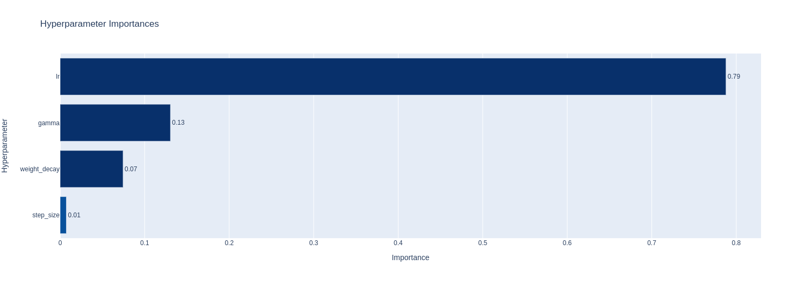

# Hyperparameters search using Optuna

We did the search for crucial parameters like learning rate, learning rate schedulers using [Optuna](https://optuna.org/) framework. 

## Instruction

Run [run_optuna.ipynb](run_optuna.ipynb).

## Optuna visualization

Optuna provides some useful insights on the searched parameters, you can visualize the study using the provided API; for instance, check the aforementioned notebook.

